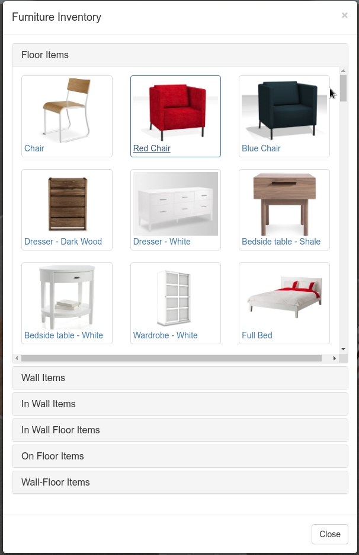

# Aura — AI-Powered 3D Interior Design Planner

Aura is a web-based 3D room planner and interior design tool featuring a live AI assistant. Designed for recruiters, design enthusiasts, and developers alike, it lets you easily sketch floor plans in 2D and instantly switch to a 3D sandbox to style surfaces and place furniture. Additionally, Aura features a context-aware AI designer powered by Google Gemini that can offer recommendations, suggest style themes, and even place items directly onto your canvas.

## Overview
Aura was created to bridge the gap between traditional 2D drafting tools and heavy 3D rendering software, packaging it in a lightweight and intuitive web interface. With custom dark glassmorphic styling, smooth vector dragging, and custom Three.js meshes, users can build layouts from templates or scratch. By providing an interactive AI Assistant, Aura shows how modern LLMs can interact dynamically with graphical workspaces instead of just outputting static text.

## Features
* **Dual-View Floor Planner**: Toggle seamlessly between a 2D drafting board (with precise wall splitting, corner dragging, and dimensioning) and a fully interactive 3D visualizer.
* **AI Design Consultant (Google Gemini)**: Sidebar chat assistant powered by Gemini 1.5 Flash. It reads the dimensions, styles, and furniture items in your active room to offer relevant suggestions.
* **Interactive Canvas Triggers**: The AI can translate your styling requests into real actions, like spawning furniture (`[TRIGGER: ADD_ITEM]`) or updating the room style theme (`[TRIGGER: SET_STYLE]`).
* **Smart Recommendation Engine**: Aura automatically analyzes your room's furniture layout, checking if your space is missing core elements matching your chosen style (e.g. Modern, Minimalist, Scandinavian, Traditional).
* **Surface Customization**: Apply distinct textures (wood, marble, carpet, tile) and custom color tints to individual walls or room floors in the 3D viewer.
* **Autosave & Local Projects**: Create blank designs or load pre-built room templates. Your projects automatically save to your browser's local storage.
* **Flexible Exports**: Export your canvas view as a PNG, export the entire 3D scene as a standard GLTF model, or download a full ZIP backup of your project.

## Technologies Used
* **Languages**: HTML5, ES6+ JavaScript, Vanilla CSS3 (Custom Dark Glassmorphic Theme)
* **Graphics Engines**: **Three.js** (for 3D graphics & scene management) and **PixiJS** (for vector-based 2D blueprint editing)
* **AI Integration**: Google Gemini 1.5 Flash API (via direct client-side requests, with an offline simulation fallback)
* **Utilities & Libraries**: JSZip (ZIP compilation), FileSaver.js (local file exports), GSAP (smooth UI transitions), FPS-Now (performance monitor)
* **Tooling**: Parcel (fast bundling and local hot reloading)

## Project Structure
Here is an overview of the important files and directories in this repository:
```text
blueprint-js/
├── images/               # Screenshots and asset graphics used in documentation
├── models/               # 3D models and surface textures (.gltf, .bin, images)
├── src/                  # Application source code
│   ├── index.html        # Main HTML layout featuring the glassmorphic sidebar and viewport layers
│   ├── index.js          # Core orchestrator; binds UI buttons, workspace actions, and sub-modules
│   ├── floor_textures.json # Registry of available floor styling textures
│   ├── wall_textures.json  # Registry of available wall styling textures
│   └── scripts/          # Modular JavaScript logic
│       ├── blueprint.js  # Main blueprint application class wrapping the 2D & 3D canvases
│       ├── ai-assistant.js # Communicates with Gemini, wraps workspace context, and executes action triggers
│       ├── recommendations.js # Rule-based heuristics for style completeness audits
│       ├── templates.js  # Pre-configured templates (Bedroom, Living Room, Office)
│       └── catalog.js    # Data definitions for spawnable furniture items
├── package.json          # Dependency specifications and run scripts
└── LICENSE               # MIT License file
```

## Installation & Setup
Follow these steps to clone the repository and run Aura locally on your computer:

1. **Clone the repository**:
   ```bash
   git clone https://github.com/Dhanya562004/Aura-room-planner.git
   cd Aura-room-planner/blueprint-js
   ```

2. **Install project dependencies**:
   ```bash
   npm install
   ```

3. **Start the local development server**:
   ```bash
   npm run dev
   ```

4. **Open your browser**:
   Navigate to `http://localhost:1234` to start designing!

5. **Build for production (Optional)**:
   ```bash
   npm run build
   ```
   This generates optimized files in the `dist/` directory.

## Usage
* **Drafting in 2D**: Open the editor tab and select **Draw New Walls**. Drag to create walls, and resize them by dragging the corners. Click on a wall or room area to rename it or adjust its thickness and elevation.
* **Adding Furniture**: Go to the **Catalog** tab. Expand categories (such as Living Room, Bedroom, Office) and click on items to drop them into your space. 
* **3D Styling**: Toggle the **Switch to 3D View** button. Click directly on any wall or floor in the viewport, open the **Materials** tab, and select a texture (wood, marble, carpet) or apply custom color tints.
* **Talking to the AI**: Click the **Gemini API Key** button in the dashboard or sidebar settings and paste your API key (grab a free one from [Google AI Studio](https://aistudio.google.com/)). Type prompts like *"What can I add to make this look cozy?"* or *"Place a green armchair in my Scandinavian bedroom."*
* **Exporting**: Go to the **Settings** tab to save a PNG screenshot of your view, export the 3D scene to GLTF, or download the workspace as a ZIP package.

## Screenshots / Demo
Here is a look at Aura's user interface and core views:

### 2D Floorplanner Mode

*Precise vector drafting with snap-to-grid gridlines, wall splitters, and dimension measurements.*

### 3D Render & Style Mode

*Interactive 3D viewing, furniture placement, and surface texture application.*

### Sidebar Navigation & Catalog Items

*Clean, glassmorphic layout detailing furniture libraries, color palettes, and AI Assistant logs.*

## Future Improvements
* **Advanced Collision Detection**: Prevent furniture items from overlapping or passing through walls in 3D mode.
* **Multi-Room Environments**: Support creating multi-story or multi-room layouts with complex doorways.
* **User Accounts**: Sync saved designs to a cloud database instead of just relying on local storage.
* **Expanded Catalog**: Support uploading custom user GLTF models directly into the workspace.

## Challenges & Learning
* **Event Synchronization**: Keeping PixiJS (2D) and Three.js (3D) synchronized on the same underlying layout model without lag required setting up a custom pub-sub event listener pattern.
* **Conversational Context**: Designing the AI prompt structure so that Google Gemini returns executable command structures (like `[TRIGGER: ADD_ITEM: Sofa]`) without breaking the natural flow of the conversation was an exercise in precise prompt engineering.
* **Vanilla Architecture**: Building a complex layout application without heavy frameworks like React or Vue highlighted the power of vanilla JavaScript DOM manipulation and helped build a solid foundation in core web APIs.

## Contributing
Contributions are what make the open source community such an amazing place to learn, inspire, and create. Any contributions you make are **greatly appreciated**.

1. Fork the Project
2. Create your Feature Branch (`git checkout -b feature/AmazingFeature`)
3. Commit your Changes (`git commit -m 'Add some AmazingFeature'`)
4. Push to the Branch (`git push origin feature/AmazingFeature`)
5. Open a Pull Request

## Author
**Dhanya k**
* GitHub: [@Dhanya562004](https://github.com/Dhanya562004)
* Email: kdhanya762@gmail.com

## License
Distributed under the MIT License. See `LICENSE` for more information.
